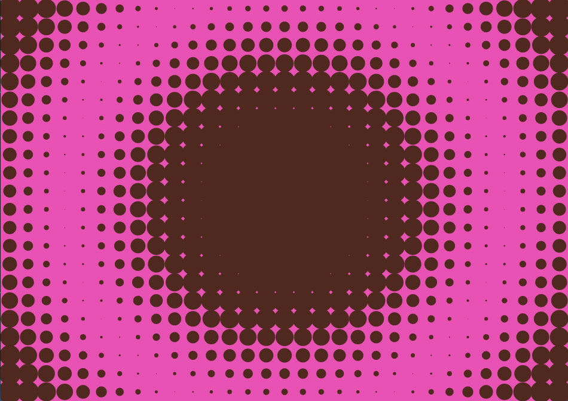

# dotsFluid

Real-time generative animation built with **JavaScript** and **p5.js**.  
The system visualizes an array of synchronized dots whose size oscillates based on distance, phase and frequency.  
User input —and periodic autonomous mutations— drive the behavior of the grid, producing fluid, evolving patterns.

**Live demo:** https://www.alejandromunoz.com.ar/dotsfluid/

---

## Concept

*dotsFluid* explores the relationship between human input, algorithmic movement and synchronized oscillation.  
By modifying a few simple parameters (density, color, base frequency), the system transforms its visual structure, producing complex emergent patterns in real time.

The work maintains a calm, continuous flow while periodically shifting into new configurations through autonomous transitions.

---

## Controls

**Color**
- `G` → randomize background  
- `F` → randomize dot color  
- `1` / `2` → predefined dot colors  

**Density**
- `A` → increase density  
- `S` → decrease density  

**Frequency**
- `←` → slow down  
- `→` → speed up  

**Save**
- `Space` → capture PNG  
- `R` → export 30-frame PNG sequence  

---

## Autonomous Mode

Every 5 minutes the system performs a soft transition where it:
- randomizes background + dot colors  
- adjusts grid density (20–160 cells)  
- modulates frequency (0.2–1.4)  

Transitions are interpolated gradually over ~20 seconds for a smooth, organic evolution.

---

## Technical Requirements (exhibition)

- **Computer:** any Mac/PC capable of running Chrome or Firefox  
- **Browser:** Chrome recommended (fullscreen mode)  
- **Internet:** not required  
- **Resolution:** adapts automatically to window size  
- **Optional:** HDMI to projector, or direct HDMI with fullscreen  
- **Proyector recomendado:** mínimo 3000 lúmenes si la sala no es totalmente oscura  
- **Audio:** no utiliza audio  
- **Modo autónomo:** ideal para exhibición continua sin interacción del público
